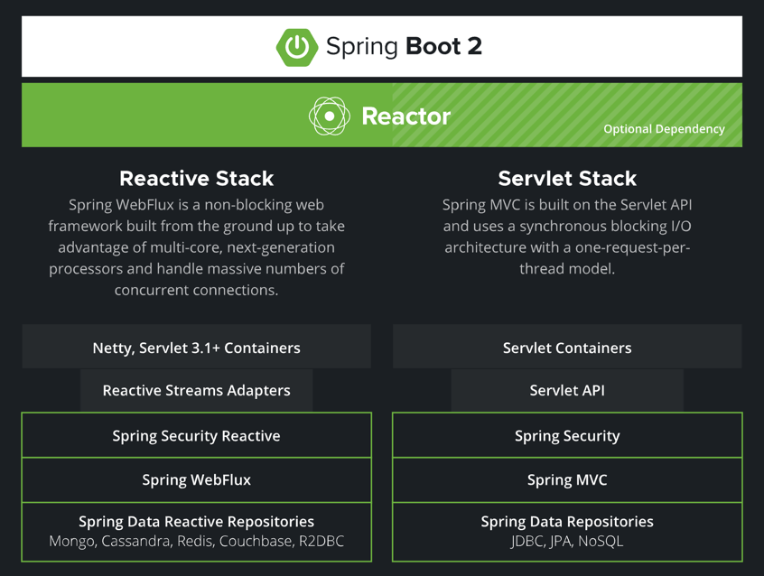

# `reactive`란?

- "Reactive Programming은 데이터 스트림과 관련된 **선언적 프로그래밍** 패러다임
    - 명령적 프로그래밍: 어떻게 하는지(how) 알고리즘을 묘사
    - 선언적 프로그래밍: 무엇을(what) 해야하는지를 묘사
- 이 패러다임을 사용하면 정적(예: 배열) 또는 동적(예: 이벤트 이미터) 데이터 스트림을 쉽게 표현할 수 있으며, 관련 실행 모델 내에 추론된 `dependency`가 존재함을
  전달하여 **변경된 데이터 흐름의 자동 전파를 용이**하게 할 수 있음

## 구성요소

- Publisher: 데이터를 생성하고 통지
    - Mono, Flux..
- Subscriber: 통지된 데이터를 전달받아서 처리
    - Mono, Flux로 반환된 데이터 스트림을 처리 `.subscribe(action)` 메소드
- Subscription: 전달 받을 데이터의 갯수를 요청하고 구독을 해지
    - Publisher, Subscriber간의 연결
- Processor: Publisher, Subscriber의 기능이 모두 있음
- Backpressure
    - subscribers가 이벤트 처리 용량을 알릴 수 있는 방법을 제공하여 publisher가 그에 따라 이벤트 emit 속도를 조정할 수 있도록 함. 이를 통해 데이터
      과부하를 방지하고 시스템에서 원활하고 효율적인 데이터 흐름을 보장

## 사용하는 이유

- 비동기적인 이벤트 처리
- 데이터 스트림 처리
- 반응형 시스템 구현

## 사용 시 고려사항

리액티브 프로그래밍은 비동기 데이터 흐름 관리와 시스템 자원의 효율적 활용을 통해 성능 향상에 기여할 수 있는 도구이다. 리소스를 더 효율적으로 활용하면서도 빠른 응답 시간을
유지할 수 있기 때문에 고용량 트래픽이나 대량의 데이터를 처리해야 하는 시스템에서 그 진가를 발휘한다. 그러나 리액티브 프로그래밍은 복잡성이 증가될 수 있음. 그리고 비동기 및
이벤트 기반의 코드는 디버깅하기 어렵고 예측하기 힘들 수 있다. 또한, 기존의 명령형 프로그래밍 스타일에 익숙한 개발자에게는 직관적이지 않을 수 있다. 따라서, 리액티브 프로그래밍
접근법을 선택하기 전에, 시스템 요구 사항과 팀의 기술 능력을 충분히 고려해야 하며 리액티브 프로그래밍이 실제로 문제를 해결할 수있는지, 그리고 그것이 가져올 이점이 추가적인
복잡성을 감내하기 충분한지 점검해야 한다.

# Spring reactive

- Mono와 Flux를 '데이터를 어떻게 처리해야하는지에 대한 행위를 지정한 것'
- Mono, Flux를 반환하고 호출하는 부분에서 subscribe(트리거 역할)를 해줘야 해당 메소드가 동작한다.
- Spring WebFlux의 비동기 흐름에서 Netty는 요청을 처리할 때 Reactor의 Publisher를 구독하여 데이터 처리를 트리거 &rarr;
  DispatcherHandler가 Publisher를 반환하고, Netty가 이를 소비(구독)하여 응답으로 데이터를 전송하는 구조
- WebFlux사용시에 호출되는 메소스들에 동기로 호출되는 메소드가 있다면 성능저하를 야기할 수 있다.



- api 호출
    - Spring MVC: RestTemplate
    - Spring WebFlux: WebClient
- DB
    - Spring MVC: JPA, JDBC..
    - Spring WebFlux:
      R2DBC (https://docs.spring.io/spring-framework/reference/data-access/r2dbc.html)
        - 각 DBMS 벤더마다 R2DBC용 드라이버 제공
        - `DatabaseClient`를 활용하여 기본적인 CURD, JPQL이외에 좀 더복잡한 NativeQuery를 생성하여 DB 호출 가능
        - `DatabaseClient`쿼리결과는 Map<String,Object>형태로 반환되므로 DTO를 정의해서 처리해야 하는 작업은 상대적으로 번거롭다.
        - https://spring.io/projects/spring-data-r2dbc#overview
- Redis
    - Spring MVC: RedisTemplate
    - Spring WebFlux: ReactiveRedisTemplate
        - https://spring.io/guides/gs/spring-data-reactive-redis
- WebFlux Test
    - MVC 테스트
        - @WebFluxTest: 대상 컨트롤러를 지정
        - @AutoConfigurationWebTestClient
        - 호출은 WebTestClient로 컨트롤러 메소드를 지정
    - 로직 테스트: `StepVerifier`
- 내장 WAS
    - Spring MVC: Tomcat
    - Spring WebFlux: Netty
        - io.netty.resolver.dns.DnsNameResolverException 발생시 `netty-resolver-dns-native-macos` 라이브러리
          추가
- 성능
    - DB Access: 실행환경에 따라 다르지만 보통 **3~4배**정도 WebFlux가 빠름
    - Redis: 실행환경에 따라 다르지만 보통 **2~3배**정도 WebFlux가 빠름
- 기타

    1. Spring MVC같은 경우에 어플리케이션 실행시에 DB, Redis 등에 바로 접속하여 해당 데이터소스에 접근여부를 판단하고 접속이 원활하지 않으면 프로그램이
       종료된다.
       하지만 WebFlux같은 경우에는 lazy하게 접속하기 때문에 스프링 시작시에 해당 데이터소스에 정상적으로 접근했는지 확인을 해야 한다.
        - HealthIndicator 인터페이스를 구현하여 애플리케이션 상태를 점검하고 연결 확인을 할 수도 있음 (`Spring Actuator`와 함께 사용하는 경우
          유용)
        - r2dbc 접속여부 체크 코드
          ```java
          @Component
          @Slf4j
          @RequiredArgsConstructor
          @EnableR2dbcRepositories
          @EnableR2dbcAuditing
          public class R2dbcConfig implements ApplicationListener<ApplicationReadyEvent> {
     
              private final DatabaseClient databaseClient;
     
              @Override
              public void onApplicationEvent(ApplicationReadyEvent event) {
                  // reactor: publisher, subscriber
                  databaseClient.sql("SELECT 1").fetch().one()
                      .subscribe(
                          success -> {
                              log.info("Initialize r2dbc database connection.");
                          },
                          error -> {
                              log.error("Failed to initialize r2dbc database connection.");
                              SpringApplication.exit(event.getApplicationContext(), () -> -110);
                          }
                      );
              }
          }
          ```
        - redis 접속여부 체크
            ```java
          
            @Configuration
            @RequiredArgsConstructor
            @Slf4j
            public class RedisConfig implements ApplicationListener<ApplicationReadyEvent> {
          
                private final ReactiveRedisTemplate<String, String> reactiveRedisTemplate;
          
                //접속여부 체크
                @Override
                public void onApplicationEvent(ApplicationReadyEvent event) {
                    reactiveRedisTemplate.opsForValue().get("1")
                        .doOnSuccess(i -> log.info("Initialize to redis connection"))
                        .doOnError(
                            (err) -> log.error("Failed to initialize redis connection: {}", err.getMessage()))
                        .subscribe();
                }
          
                /**
                 * 기본적으로 ReactiveRedisTemplate은 ReactiveRedisTemplate<String, String> 형태만 제공된다.
                 * 추가적으로 다른 타입을 받고 싶으면 아래와 같이 코드가 추가되어야 한다.
                 */
                @Bean
                public ReactiveRedisTemplate<String, User> reactiveRedisUserTemplate(
                    ReactiveRedisConnectionFactory connectionFactory) {
                    var objectMapper = new ObjectMapper()
                        .configure(DeserializationFeature.FAIL_ON_UNKNOWN_PROPERTIES, false)
                        .registerModule(new JavaTimeModule())
                        .disable(SerializationFeature.WRITE_DATE_KEYS_AS_TIMESTAMPS);
          
                    Jackson2JsonRedisSerializer<User> jsonSerializer = new Jackson2JsonRedisSerializer<>(
                        objectMapper, User.class);
          
                    RedisSerializationContext<String, User> serializationContext = RedisSerializationContext
                        .<String, User>newSerializationContext()
                        .key(RedisSerializer.string())
                        .value(jsonSerializer)
                        .hashKey(RedisSerializer.string())
                        .hashValue(jsonSerializer)
                        .build();
          
                    return new ReactiveRedisTemplate<>(connectionFactory, serializationContext);
                }
          
            }
            ```
    2. `blockbound`: 프로그램시작시에 블로킹되어 호출되는 메소드가 있는지 체크

        - https://github.com/reactor/BlockHound
        - 어쩛수 없이 `blocking`되어 호출되는 함수가 있을 경우 아래와 같이 추가할 수 있음.
            ```java
            BlockHound.install(builder -> builder.allowBlockingCallsInside(TemplateEngine.class.getCanonicalName(),"initialize"));
            ```
        - [스프링-웹플럭스Spring-WebFlux-에서-블록하운드BlockHound-사용하기](https://velog.io/@adduci/%EC%8A%A4%ED%94%84%EB%A7%81-%EC%9B%B9%ED%94%8C%EB%9F%AD%EC%8A%A4Spring-WebFlux-%EC%97%90%EC%84%9C-%EB%B8%94%EB%A1%9D%ED%95%98%EC%9A%B4%EB%93%9CBlockHound-%EC%82%AC%EC%9A%A9%ED%95%98%EA%B8%B0)